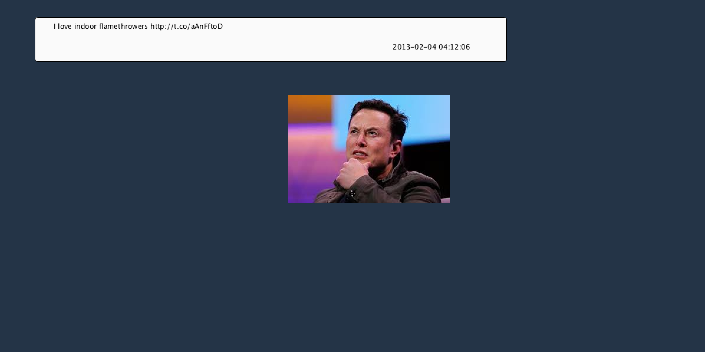
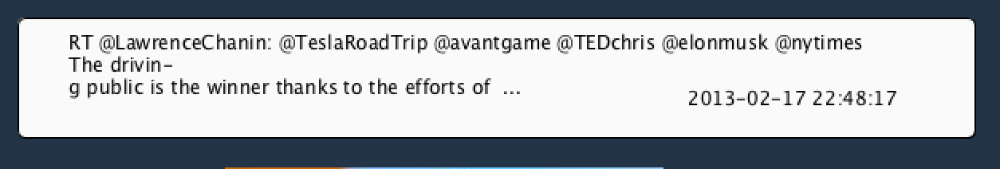

# Elon Musk Tweet Generator

For this week's assignment I decided to make an Elon Musk Tweet generator. Each time the user clicks the mouse, a new tweet is pulled up, and a new funny image of Elon Musk from the list of images. The image was originally static, but in playing around with the code the image started to get redrawn frequently and we found it so funny that we decided to embrace it and just slow it down a little with a counter.

Here is a [video](https://youtu.be/leqRpkybDnI) of the piece in action.

## Tricky Parts & Problems

**Breaking up the tweet**

I wanted to break up the tweet into two lines if over a certain number of characters, which I did by creating two separate strings in an if statement using .substring. The tweets are broken up into a new line using a hyphen "-" and the "\n". The issue is that I don't know how to recognize the placement based on words, so that it doesn't splice a word in half.

**Counter for images**

When we made the image position random, it moved around because it was in draw. We enjoyed it a lot but wanted to slow it down, so my friend showed me how to create a counter variable that, every time it is divisible by 10, the position changes.

**Font**
I wanted to change the font but kept getting an error. Some were about PFont and others were about 'badly formed character constant'. Not quite sure what is wrong, since I'm using the textFont, except not having the font loaded perhaps?

## Sources

**Data:

data_elonmusk.csv found at: []https://www.kaggle.com/kulgen/elon-musks-tweets/data

**Images:

elonzipline.jpeg found on [Google Images](https://www.google.com/imgres?imgurl=https%3A%2F%2Fpbs.twimg.com%2Fmedia%2FC-izroIUAAAjghR.jpg%3Alarge&imgrefurl=https%3A%2F%2Ftwitter.com%2Fbenny_the_jets%2Fstatus%2F858133698348232705&tbnid=1y6YeFR92bXDnM&vet=12ahUKEwjCwvCYtuzoAhVYwIUKHfoKBdgQMygEegUIARD0AQ..i&docid=eFkKa3BXpiGlRM&w=659&h=369&q=elon%20musk%20zipline&ved=2ahUKEwjCwvCYtuzoAhVYwIUKHfoKBdgQMygEegUIARD0AQ)

elonsmirking.jpeg found on [Google Images](https://encrypted-tbn0.gstatic.com/images?q=tbn%3AANd9GcR64Nw63WFUpl4wax1Zs-tyMK5t1-wbJIYVdqiAJhRjnff260SS&usqp=CAU)

elonthinking.jpeg found on [Google Imagse](https://www.google.com/imgres?imgurl=https%3A%2F%2Fimg.dtnext.in%2FArticles%2F2019%2FOct%2F201910210416054436_Musk-gone-offline-funny-posts-online_SECVPF.gif&imgrefurl=https%3A%2F%2Fwww.dtnext.in%2FNews%2FBusiness%2F2019%2F10%2F21041605%2F1193192%2FMusk-gone-offline-funny-posts-online.vpf&tbnid=vtELBxKzXAH6ZM&vet=12ahUKEwiLh5OltuzoAhVW0IUKHcWIDvcQMygJegUIARCXAg..i&docid=_zURrfOnIkc-eM&w=620&h=414&q=elon%20musk%20funny%20&ved=2ahUKEwiLh5OltuzoAhVW0IUKHcWIDvcQMygJegUIARCXAg)

eloncat.jpg found on [Google Images](https://www.google.com/imgres?imgurl=https%3A%2F%2Fi.pinimg.com%2Foriginals%2Fdf%2F1f%2Fee%2Fdf1feeaeae5a2a69f39689237b7bf828.jpg&imgrefurl=https%3A%2F%2Fwww.pinterest.com%2Fpin%2F837880705644771640%2F&tbnid=ejVegqYvMBazjM&vet=12ahUKEwiLh5OltuzoAhVW0IUKHcWIDvcQMygTegUIARCsAg..i&docid=CebpejN-nylNyM&w=800&h=1200&q=elon%20musk%20funny%20&ved=2ahUKEwiLh5OltuzoAhVW0IUKHcWIDvcQMygTegUIARCsAg)

elontpoint.jpeg found on [Google Image](https://www.google.com/imgres?imgurl=https%3A%2F%2Fwww.incimages.com%2Fuploaded_files%2Fimage%2F970x450%2Fgetty_1130598318_401260.jpg&imgrefurl=https%3A%2F%2Fwww.inc.com%2Fdraft%2F1567638459.html&tbnid=-BrJc4V-eAHNFM&vet=12ahUKEwiLh5OltuzoAhVW0IUKHcWIDvcQMygBegUIARCFAg..i&docid=qt-UXh7oFNY1vM&w=970&h=450&q=elon%20musk%20funny%20&ved=2ahUKEwiLh5OltuzoAhVW0IUKHcWIDvcQMygBegUIARCFAg)

elonjoint.jpeg found on [Google Images](https://www.google.com/imgres?imgurl=https%3A%2F%2Fcdn.cnn.com%2Fcnnnext%2Fdam%2Fassets%2F180907100732-elon-musk-smokes-marijuana-podcast-1-large-169.jpg&imgrefurl=https%3A%2F%2Fwww.cnn.com%2F2016%2F08%2F03%2Fworld%2Felon-musk-fast-facts%2Findex.html&tbnid=1Ee91EUt_BHRrM&vet=12ahUKEwiLh5OltuzoAhVW0IUKHcWIDvcQMygEegUIARCLAg..i&docid=oz2UUjt8m_6W7M&w=460&h=259&q=elon%20musk%20funny%20&ved=2ahUKEwiLh5OltuzoAhVW0IUKHcWIDvcQMygEegUIARCLAg)

elonmeh.jpeg found on [Google Images](https://www.google.com/imgres?imgurl=https%3A%2F%2Fmk0analyticsindf35n9.kinstacdn.com%2Fwp-content%2Fuploads%2F2020%2F03%2FTesla-Reuters.jpg&imgrefurl=https%3A%2F%2Fanalyticsindiamag.com%2Fthe-many-failed-predictions-promises-by-elon-musk%2F&tbnid=v3DMOG6ms0KvrM&vet=12ahUKEwiLh5OltuzoAhVW0IUKHcWIDvcQMygDegUIARCJAg..i&docid=q_P101lPAUEHLM&w=890&h=501&q=elon%20musk%20funny%20&ved=2ahUKEwiLh5OltuzoAhVW0IUKHcWIDvcQMygDegUIARCJAg)

