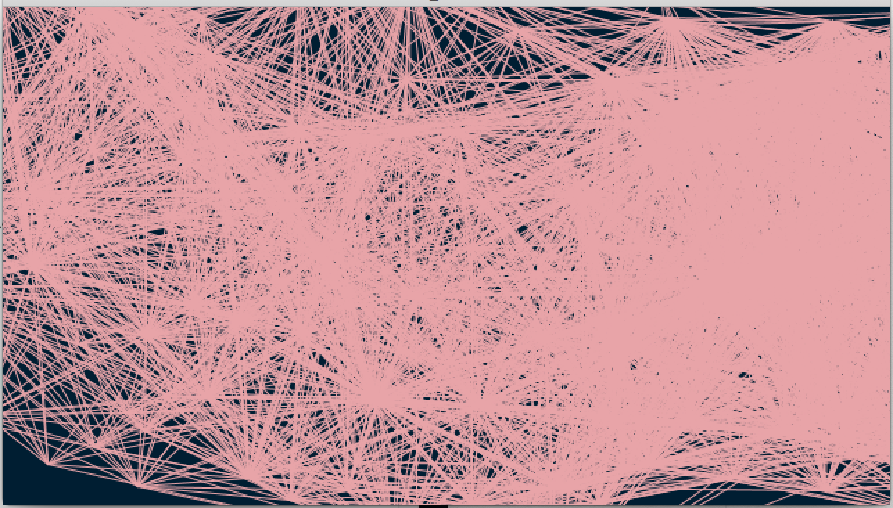
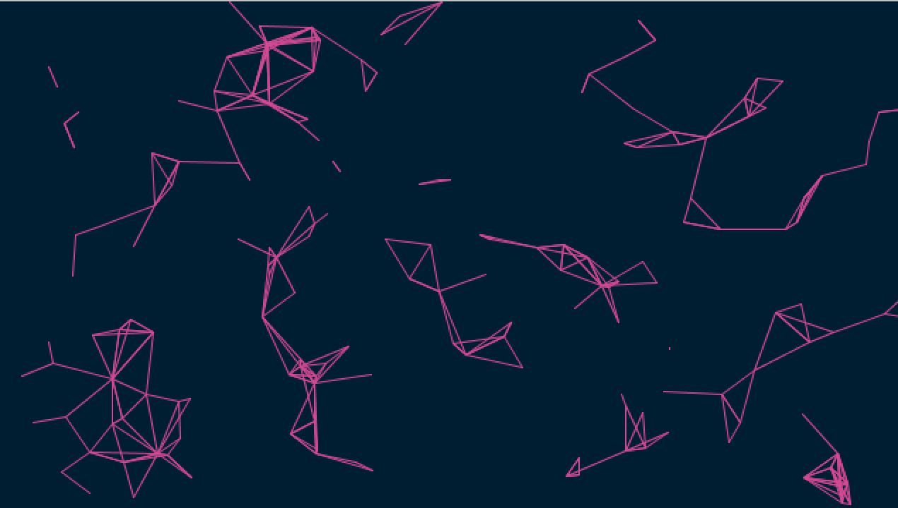
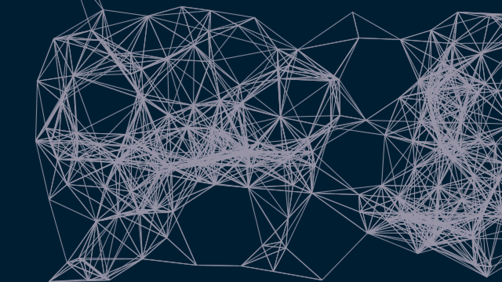
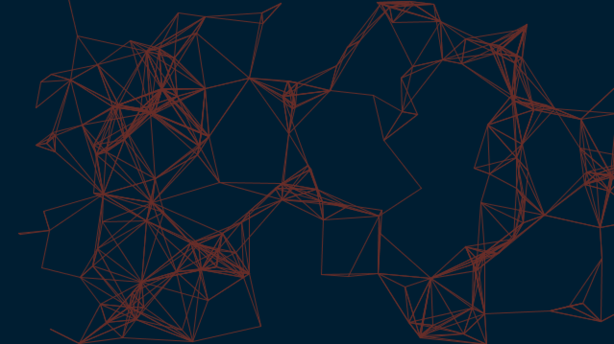
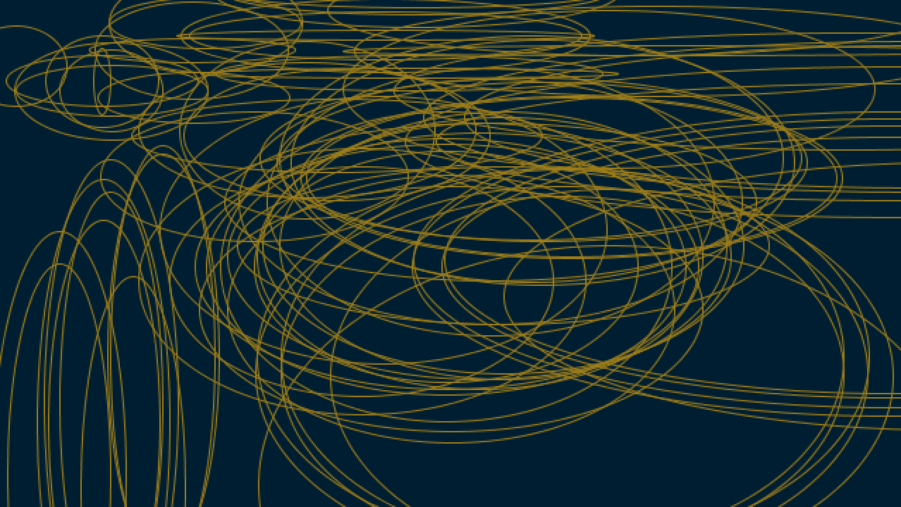

# Messing with Example

For this week, we messed around with the in-class example and seeing what we can do to change it. I struggled to expand beyond it much. Though I eventually understood 

## Different Radius Numbers

I played around with the radius number first, too see what that would look like. The pink lines are with a number between 0 and 300, the magenta is 0,50, the white is 50,100, and the oragne is 10,80. 

   
   

## Circles instead

Then, I drew a version using ellipse/circles instead of lines. 

## Speed, colors, and mouseClicked

I really enjoyed playing around and increasing the acceleration, but I wanted it to be prompted. So I made a new function for mousePressed() that speeds up the acceleration to .1 when the mouse is pressed, to make it a little more satisfying to play around with. I then also decided to make the colors change randomly when doing that by creating a stroke(random(255), random(255), random(255)) that makes almost a strobe effect.

Here is a [video](https://youtu.be/vhyeKGA_ibU) of the example.

