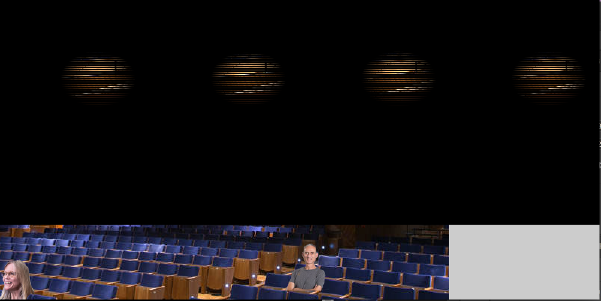

# Find Them! A spotlight search game

My playing with drawing was relatively simple, inspired by Dan Shiffman spotlight example in his [tutorial](https://www.youtube.com/watch?v=j-ZLDEnhT3Q). The goal of the game is to find four 'people' in the theatre space, using your mouse as a kind of flashlight or spotlight that illuminates an area around it. The code does this by finding the pixels in the radius around the cursor and specifically 'brightening' them. Then, the user can click on the person when they find them and it crosses the name out. 

[Watch the game in action.](https://youtu.be/numXbNauEB8)

## Problems and More

Above all, I know that this is a very repetitive project that probably could be simplified and use more loops or arrays or things. I'm just not sure what that would look like.

### Canvas vs image size

I had to add the rectangle to the side manually on Photoshop, so that the entire image was the size of the 800x400 canvas. If I tried to run the code with a 600x400 image (which is just the part with the theatre), it would break and have a repeated disjointed image (see below). We think this is because the Pixel array uses the whole canvas, so I would have to either find  a way for the for loop that creates the spotlight to differentiate between image pixels and the rest of the canvas, or draw a canvas within a canvas, which did not seem to be possible. 

### Locating the face

Ideally, if I were to return to this project, I would create a way to locate the face more automatically. Right now, I had to print out the x and y locations of each  image, then code that as a universal variable. With just four images, that was fine, but I can only imagine how much work that would be if I wanted more images. Maybe there would be a way to notice it based on pixel colors?

### Placing the faces
I placed the faces using Photoshop, since it was easier. I would want to experiment with placing the faces through Processing, which would allow me to move them around more (and then also locate the face more easily, solving the previous problem). The problem was the if I called the faces, I could not also draw the pixels and spotlight without overlapping and losing the faces. I just realized while typing this that it may only be an order thing, though...so that will be something I check.

