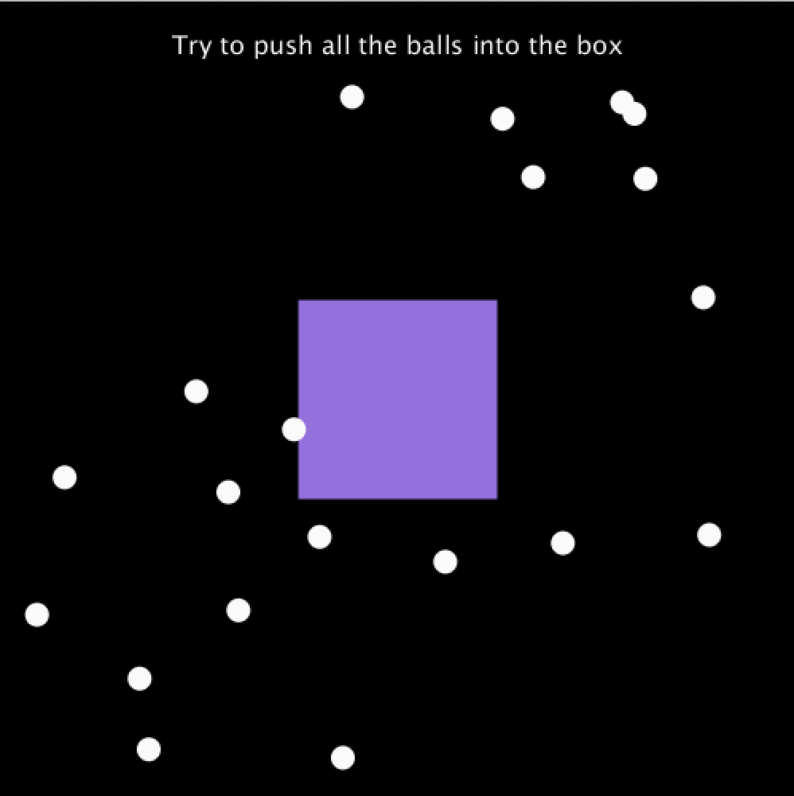
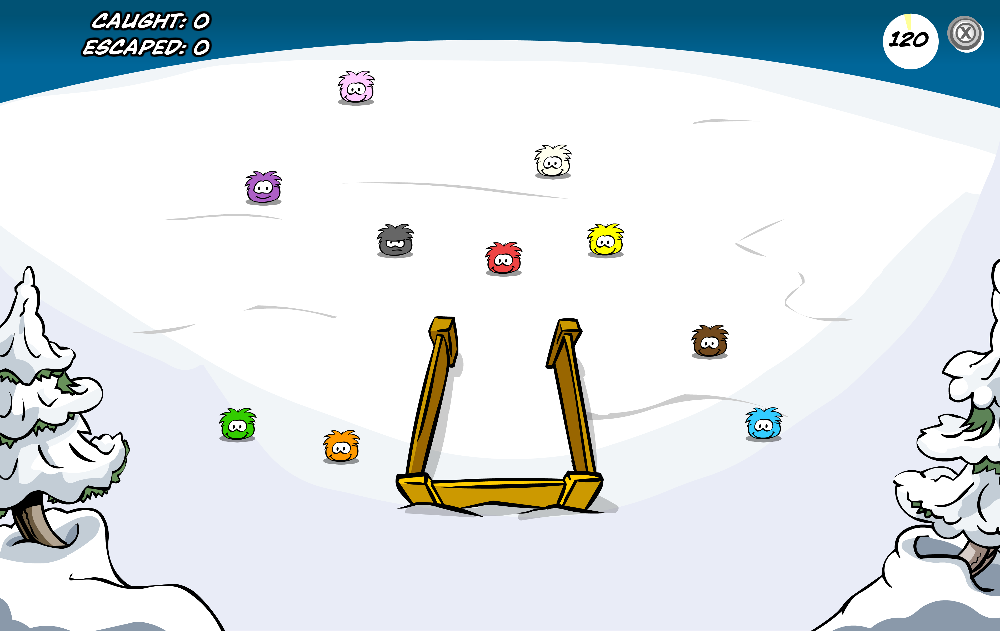
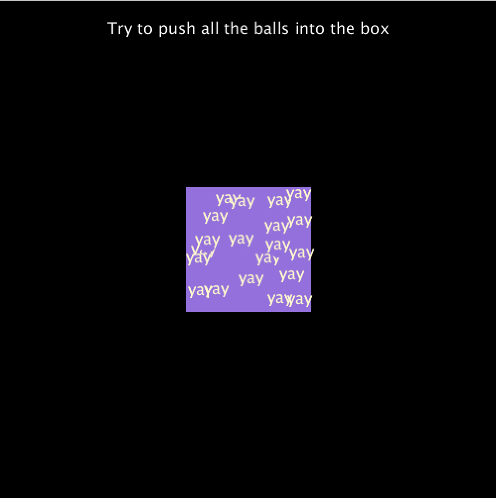

# Ball Roundup Game

Inspired by the ['Puffle Roundup' game](https://www.youtube.com/watch?v=1CJY_f6Bb98) on *Club Penguin* the goal of this game is to push all the balls into the square. The mouse acts to 'push' the balls in the opposite direction and once a ball goes into the square there is a little 'yay' and the ball 'disappears' (changes color).
You can watch a video of the game [here](https://youtu.be/jNPc2PBGi4E).

## Process of creating the game

The code is heavily based on the [in-class example](https://github.com/michaelshiloh/simpleProcessingClassExample) of object-oriented programming that created lots of balls moving around the screen. The code was adapted for the game so it would move based on whether the ball was within a radius of the cursor. This allows the user to push the ball into the square!

## Problems and ideas to add

**The radius if-statement**

The thought-process of figuring out how the cursos radius would look in code, and how to get the ball to properly react, was the most complicated portion of the code. Mostly an exercise in logic, it is still not as simple as I would like it but I didn't want to play around with it more in case it broke. 

**Finishing the game**

I would love to add a function that recognizes when all the balls are in square and actually ends the game.

**White outline of balls**

For some reason there was a white outline on the balls when they were in the purple box, despite a noStroke(); I ended up just making stroke(purple) and that got rid of the problem, but it would be nice to know what the issue there is. 

**Not placing balls in square**

Because of the limitations of the random() when creating the array and populating with objects in setup, I couldn't figure out how to get the balls to NOT appear in the box when the game starts. 

