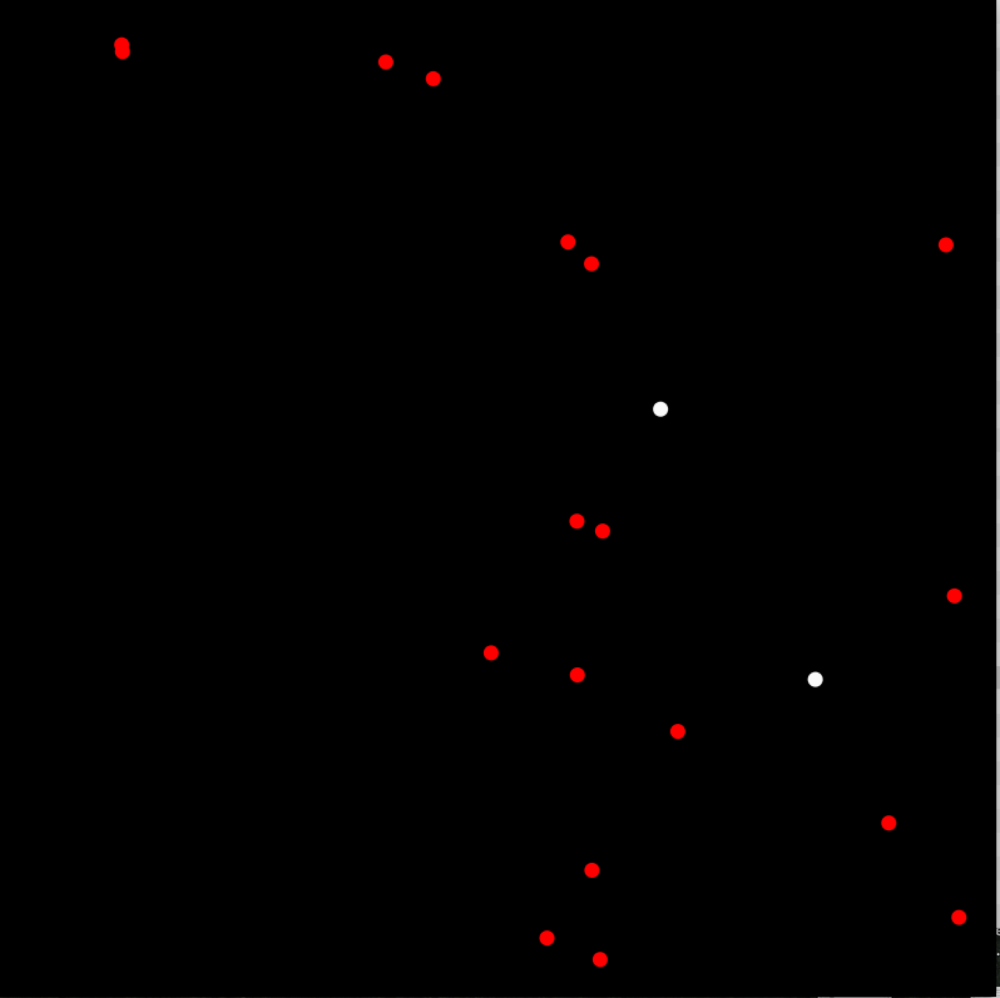
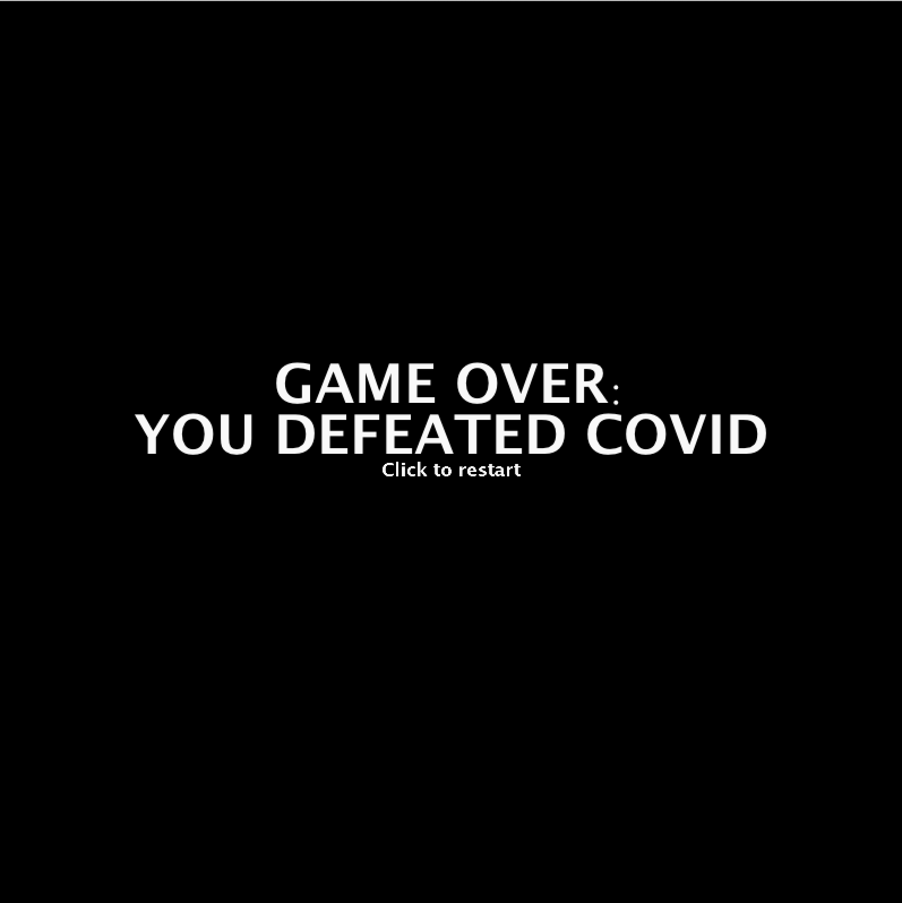
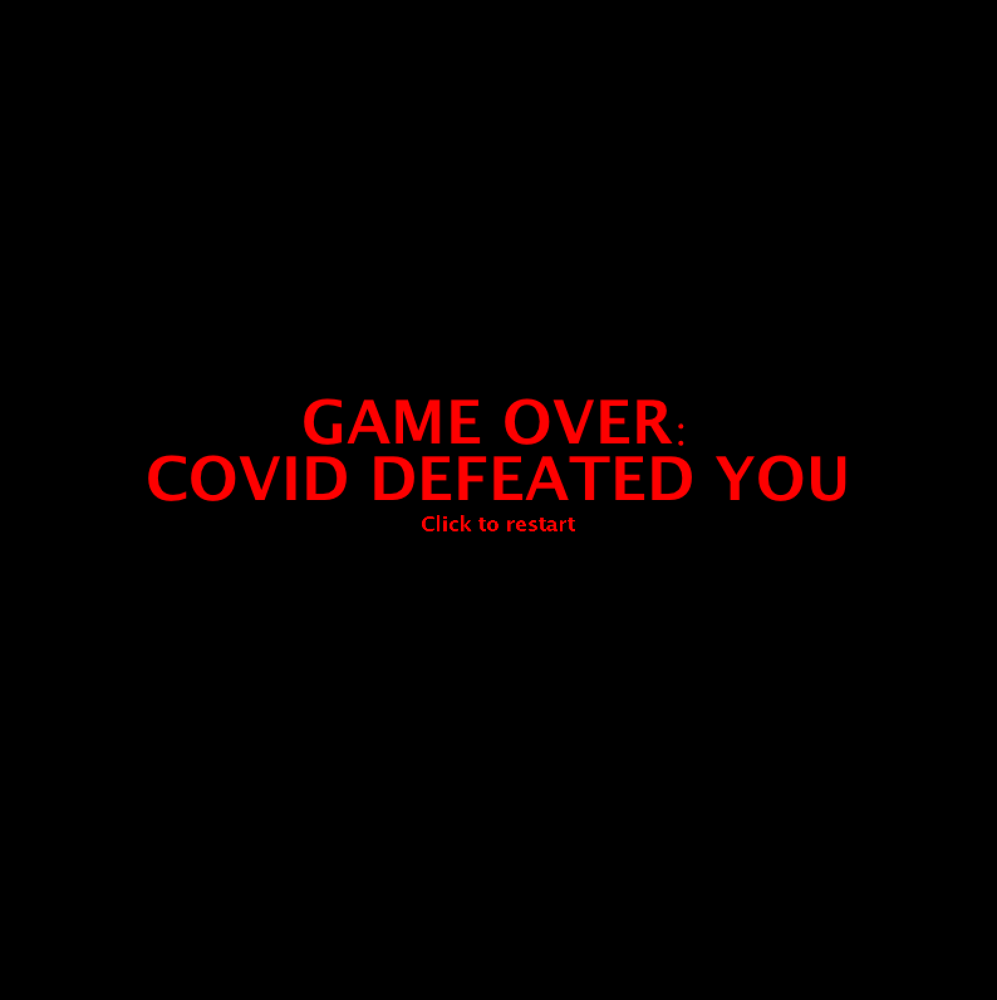
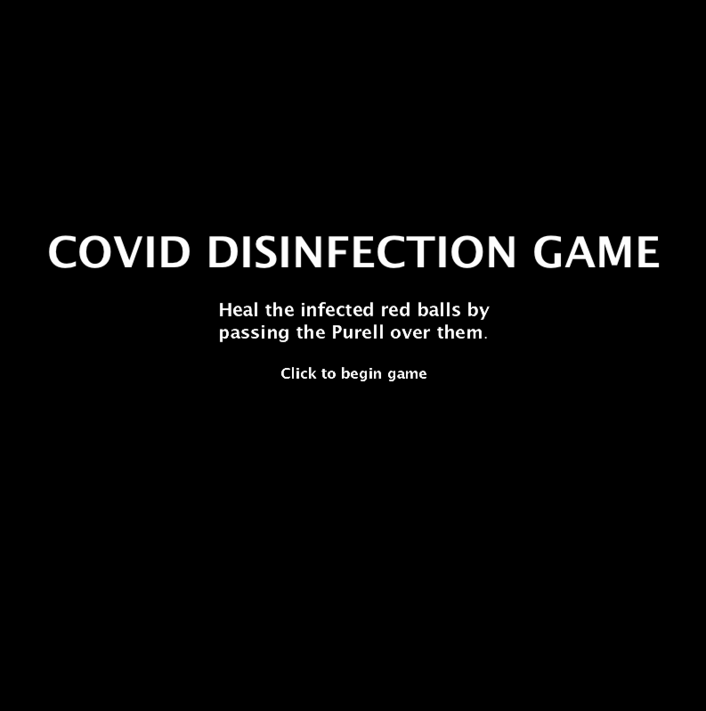
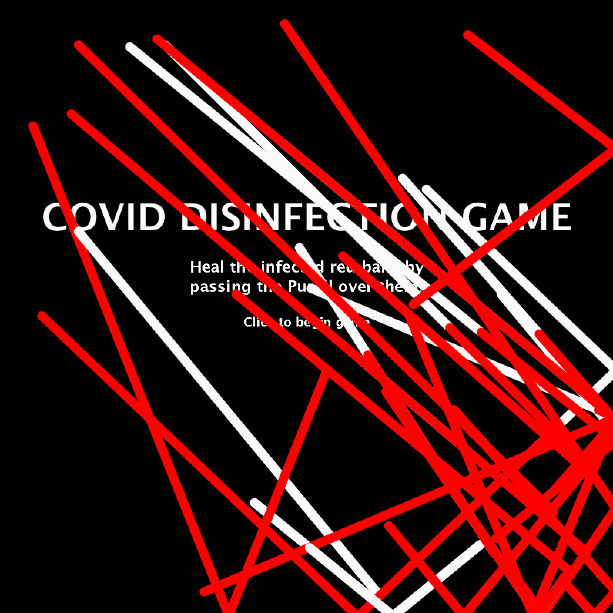

# FINAL PROJECT: COVID DISINFECTION GAME

The final project allowed us to do anything using the skills we learned in Processing, so I wanted to experiment with something that brought together several of the lessons I had learned.

## Game Explanation

The goal of the game is to 'disinfect' all the infected (red) people (represented by balls moving around on screen) by moving your cursor (which is a Purell bottle) over it. The tricky part, however, is that if any healthy (white) ball bumps into an infected (red) ball, that one becomes infected as well. The player has to try and 'heal' all the balls before they all become infected.

### Ball Class

The first hurdle in creating the game was creating a ball class that:

**1) Created two different colors of balls**

I had struggled in the past with creating different colored objects within a class, so for this I knew I wanted two colors of balls. I ended up making type a part of the constructor, so it was either 1 or 2 (note: also struggled with generating random numbers rather than a range, which was solved using round(random(1,2)). 

**2) Had the balls bounce off each other**

Though I could easily figure out how to have the balls bounce off the edges of the screen, since that point does not change, it was more difficult to figure out how to get them to recognize they were bouncing off each other. At first, I tried creating another array that would hold all the positions and check that, but it wasn't working properly and I couldn't figure out where I had mismatched the ball's position and what this new array held. I ended up basing it off of Aaron's code that would iterate through the array itself (since every object holds its own information) and then, as long as it wasn't checking it against itself, collide and go in opposite directions.

**3) Change the white balls to red balls when colliding**

It ended up being relatively simple, because I added this to the same function that did the collision, and just made it so that if the types were different when they collided, they would both become type 'red'. This worked since if two white balls collided, they were not different so nothing changed, but if a red and white ball collided, they would both be changed to 'red' but that would only seem to change the white one.

**4) Check the mouse to 'heal' the balls**

Possibly the simplest of the hurdles, since I did this after figuring out how to change the color of colliding balls, but just played around with the distance from the mouse that made sense when playing the game and made is so that if the mouse was on the red ball, it would change it to type 1, which is white in color.

### Title and End Screens

I'd never experimented with moving to different screens within my projects - my games had always just started. So for this game, I added 'end screens' that declare the game to be lost or won. Triggering these was a little tough, since I had wanted to put them in the same function but ended up needing both a checkCured and checkInfected that could see if there were still any infected or healthy balls, respectively. If there were, the function would just return, but otherwise, it would mean there was only one type of ball left and the game would be declared over.

 

The Instructions starting screen was a little trickier, since anything I did at first just made the game play behind the text of the instructions page. I looked it up and adapted [this code](https://forum.processing.org/two/discussion/11615/how-to-make-an-instruction-scene-before-start-game) for my instruction page - making it a boolean that returned false once the mouse was clicked, moving it on to the game. Making sure the background was redrawn made sure that the balls didn't connect to each other (don't really understand this part, but it has been fixed).

 

### Game Over Jingles

Since I had never really used music in my projects before, I wanted to make sure that I used it in this. I downloaded game jingles from [this forum](https://opengameart.org/content/69-game-over-jingles-pack) and used them to play during the end screens. But the sound was very disjointed and would start off normal but become really strange. Brian helped me figure this one. Because the sound was being called to play in the draw function, it kept repeating it and that is what made it distorted. To fix this, I created a function called playGame that held this music and everything else instead. 

### Issues With Game

The one noticeable problem with the game is that occasionally, two balls will hit each other in such a way that they get stuck to each other and don't seem to collide off of each other. I'm not entirely sure why this happens, unless they happen to collide in a way that causes them to keep colliding into each other and the game slightly glitches - since techincally they are reversing their own velocity and aremnot basing it on the ball they hit. 

The other issue that is less noticeable and actually hasn't occured to me yet, is all the balls randomly getting assigned to red or white, causing the game to immediately go over. I know I could test for all types the same way I am testing for the end screen, so that it just only draws it if not all balls are one type, but I've run into issue of how that affects the end screen being called. 

## Further Ideas

1) Create different 'difficulties' by having the title screen have two options (for example either key pressed or  mouse pressed) that go into different game play modees. The more difficult levels could have a purple ball that is stationary, for example, but that your mouse CANNOT go over because it is allergic to Purell.

2) Some kind of timer or way to track how close or far you are to healing all the balls (like a percentage bar).

3) More or different colors in the backround. I wanted to use an image but things seemed distracting so I kept the black background for now.

## References

Ball class code: www.openprocessing.org/sketch/434739/

Collision code: github.com/aaronsherwood/introduction_interactive_media/blob/master/processingExamples/drawing/connectedLines/connectedLines.pde

Music for jingles: opengameart.org/content/69-game-over-jingles-pack
Used "49. What the World's Hoping For" and "56. Sad Strings" by Casey Frantum

Instructions screen code: forum.processing.org/two/discussion/11615/how-to-make-an-instruction-scene-before-start-game

