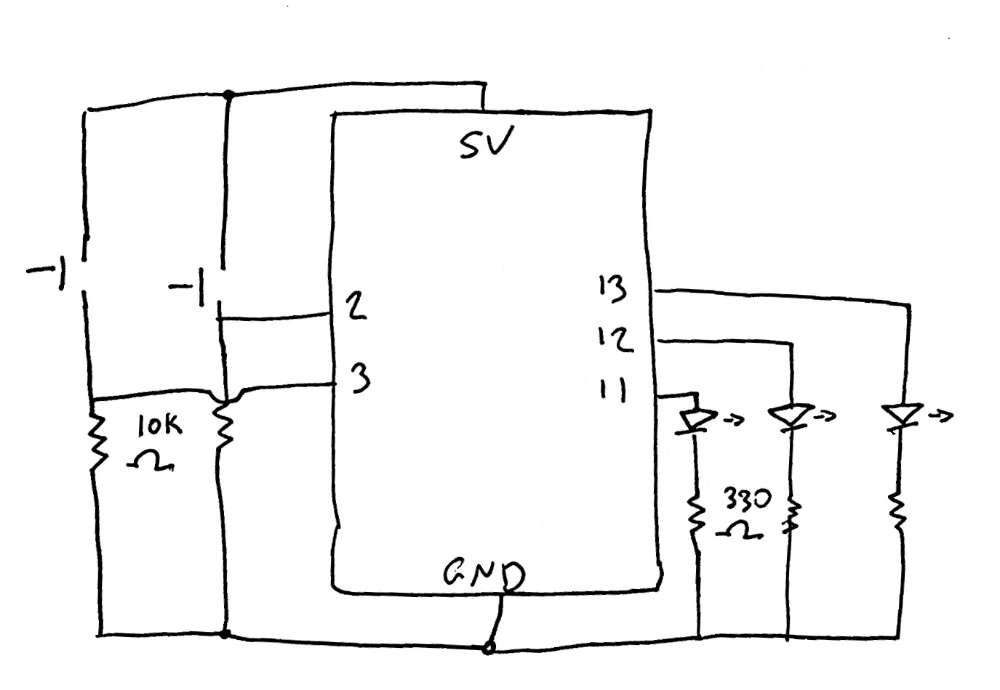

**Multiple Digital Inputs and Outputs Assignment**

This assignment I have two buttons with three light output options. Pushing the yellow button lights up the yellow LED, pushing the blue button lights up the blue LED, but pushing both at the same time lights up the green LED (a mix of the two primary colors!)

Making sure that the blue/yellow light would also turn off when they were both pressed (if not pressed at exactly the same time, the Arduino would read it as on, and therefore I would have both the blue LED and another colored light turned on) was fixed by coding to have those lights turn off when both buttons were pressed. Sometimes this makes a light flicker on before the green light does, showing which button was pressed first.

[Here](https://youtu.be/HS56A2f-eK4) is a video of my assignment, with the code for it [here](    ).

**My schematic for the project**

 

