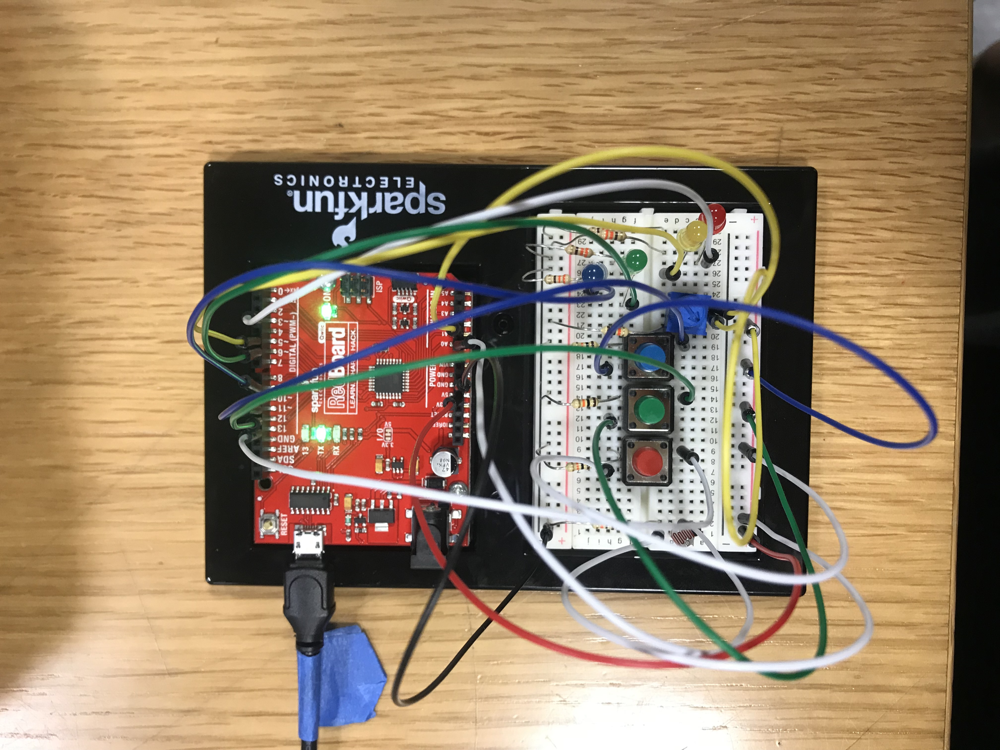
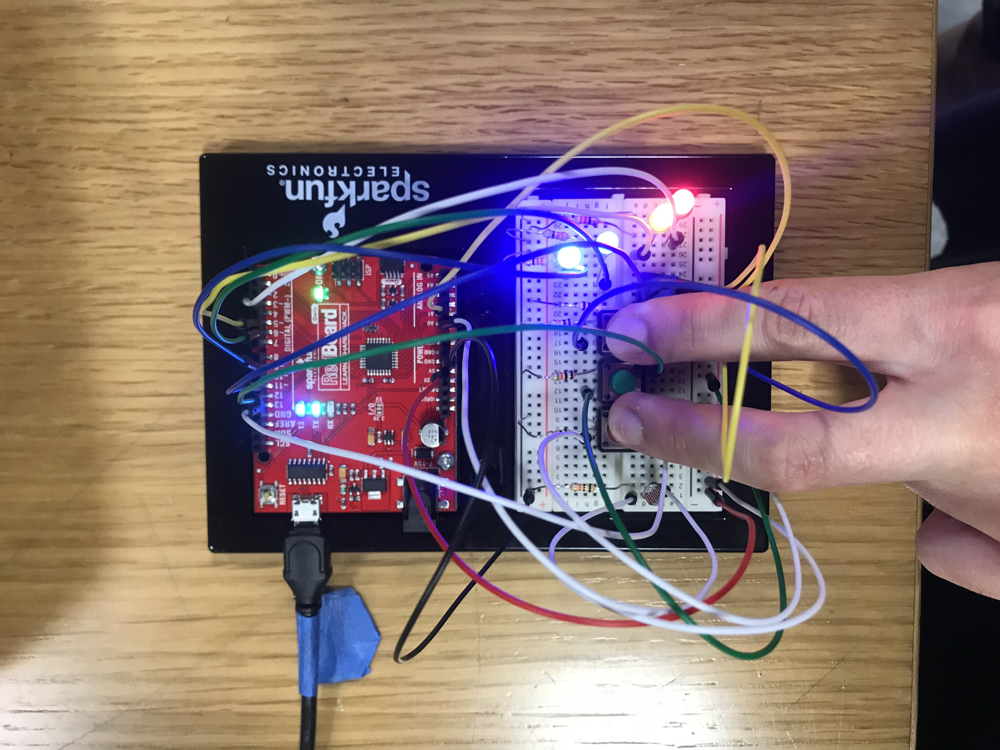
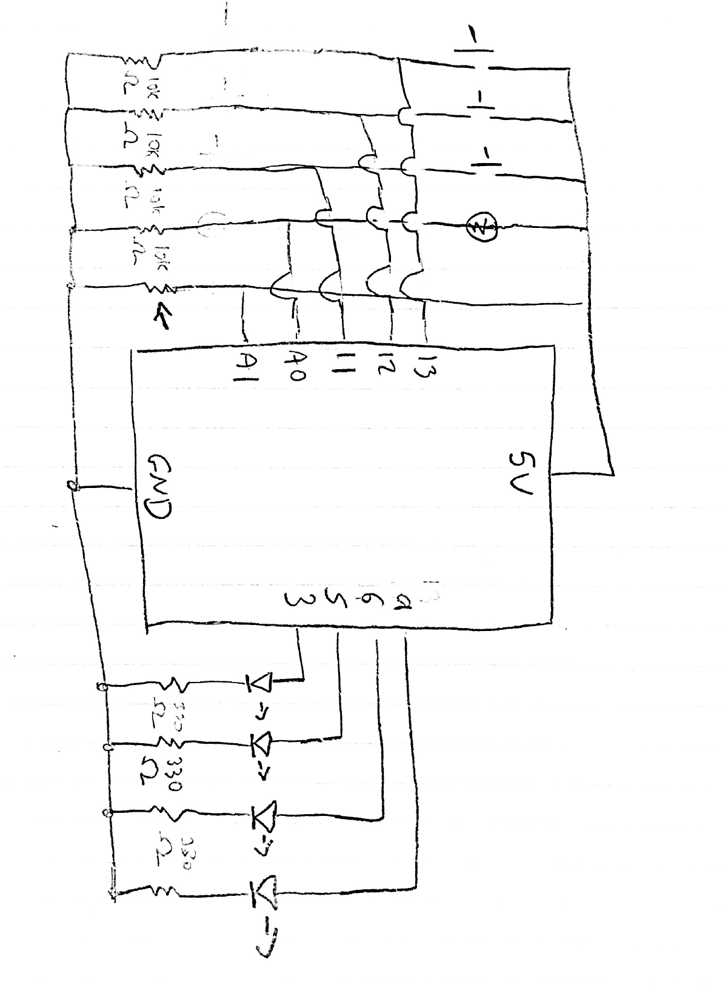

The goal of this puzzle circuit is to turn on all the lights to a consistent bright power - but there are steps to figure out how to do so. First, use the light meter to see what color button(s) you must press to turn on some of the lights. Then, use the sliding switch to turn on more light(s) and put the pieces together to see all the lights turn on!

**Here are pictures of my circuit**

**[Here](https://youtu.be/8g22FEsRuYo) is a video that shows my project**

**Process**
The first thing I figured out was getting the light sensor to work. I had a lot of problems with making the red and blue LEDs turn on brightly when the light sensor was in use. Even though it worked in my first test, the more I added to the code, it seemed to dim (even though having it just turn on one or the other didn't seem to change the brightness, in case it was an issue of power being split?). The light sensor is my first analog sensor.

Once the lights are (dimly) on, they will prompt the user to press the red and blue pushbottons. I coded the green button to turn off all the LEDs, so that the user could not just press all three pushbuttons and get a light output.

For the fourth (green) LED, I wanted to use a sliding switch at first, but it never worked. It stayed on HIGH at all times, making it impossible to use it to control the last, green LED. Hopefully I can figure this out later. I switched to the potentiometer. Another glitch was that it kept blinking when turned on by the potentiometer, which we believe was caused by the // Green button is pressed action turning off all the lights, so it looped on and off. Removing it, however, left the green LED on all times, so I kept the blinking on as an added feature so that all lights had to be bright constantly.

