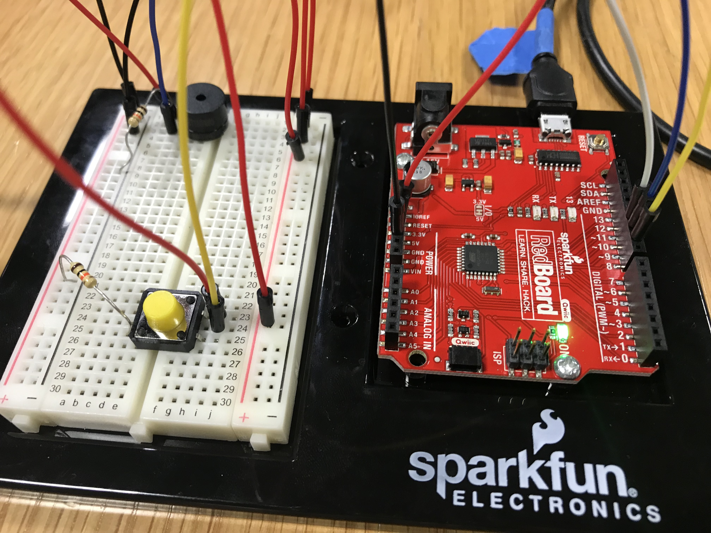
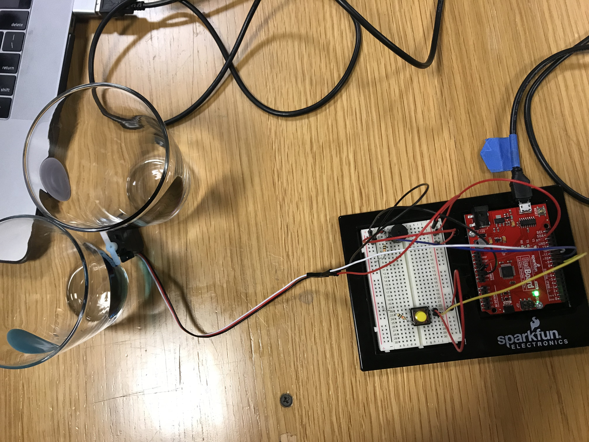
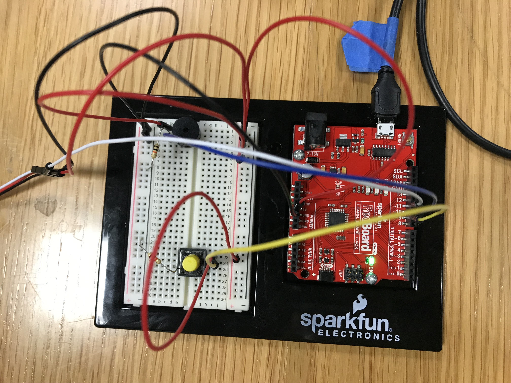
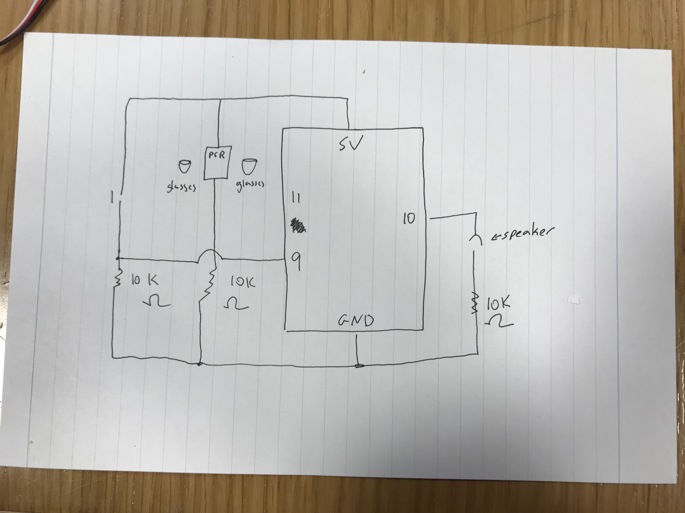
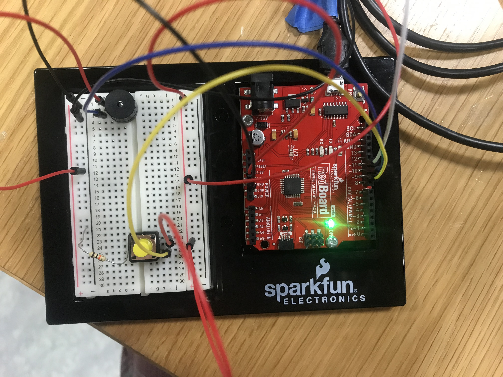

The idea behind this instrument was to play the song Frere Jacques (Brother John) but nothing seemed to work so it became simpler and simpler (though it still doesn't work, hence there is no video).

First, the instrument would require the user to cover the light sensor, playing the lines: "Are you sleeping? Are you sleeping? Brother John? Brother John?" which are the notes C4D4E4C4 C4D4E4C4 E4F4G4 E4F4G4

Then, the user would press the Yellow Button to play the next lines: "Morning bells are ringing, morning bells are ringing" that correspond to G4A4G4F4E4C4 G4AG4F4E4C4. The final section is C4G3C4 C4G3C4 that sounds like the "Ding Dong Ding, Ding Dong Ding" of bells. At this point, the servo motor was supposed to rotate from 0 to 180, hitting two glasses it was next to (since I don't have bells).

Unfortunately, none of it seemed to work. To simplify it, we tried betting rid of the light sensor but the sounds still wouldn't play, and though the Servo Motor turns when the code is first uploaded, it doesn't respond to the "If" statement of the Yellow Button (even though a Serial Print seems to show that it is working or responding to the press). 

I checked the speaker against an example code, so I know the speaker works, but just doesn't play the notes I want it to (even though they are in the pitches.h file I added to my code. If I change the notes in my code to the ones given, it will play it, but I can't figure out what is causing it to play. It will run through it once, then pause and go through it again after a delay. Sometimes it seems that it is prompted by the button, other times not.

I genuinely have no idea what is happening, I've gotten help from people but it doesn't make sense to me. I know there is something wrong with my If statement, but even then the music I WANT should be playing in this sporadic manner that the melody code does. 

**Here are pictures of my circuit**

**UPDATE**

The button wasn't working because the circuit had not been properly built (the input was going nowhere). Then, the melody had likely been off because the for loop, where it says 'thisNote < X number' has to be the same as the number of notes, since it starts counting at 0. Because we had 17 instead of  16, the code wouldn't run past that point. There was also at one point an issue with a duration of 0, which also broke the code since 1000/0 for the duration makes it infinity.

**New circuit**
*Note that the yellow button pin wire has been moved, the resistor for the tone speaker removed, and the speaker getting a wire from GND rather than 5V*

