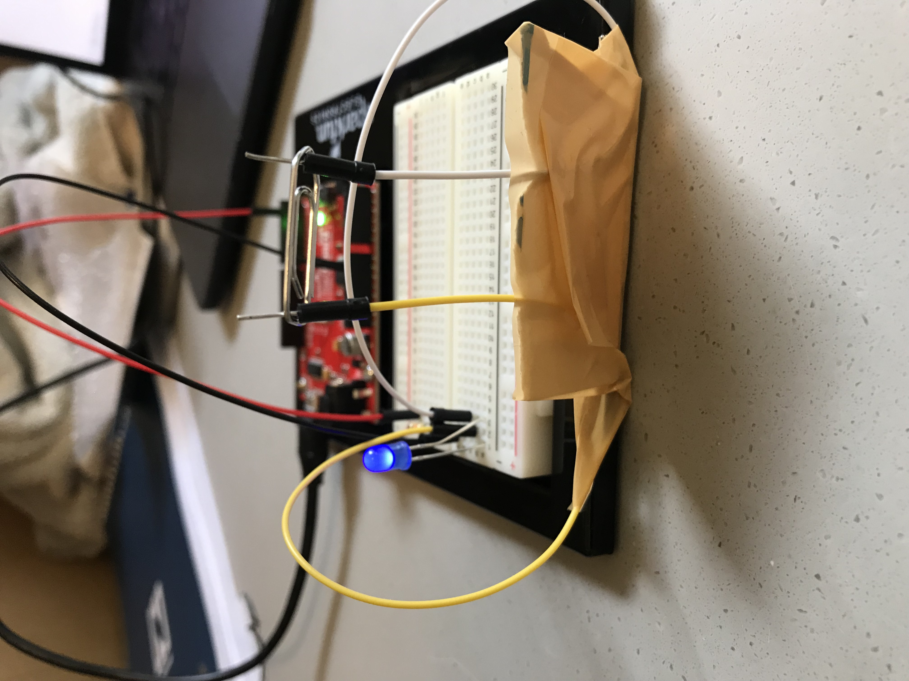
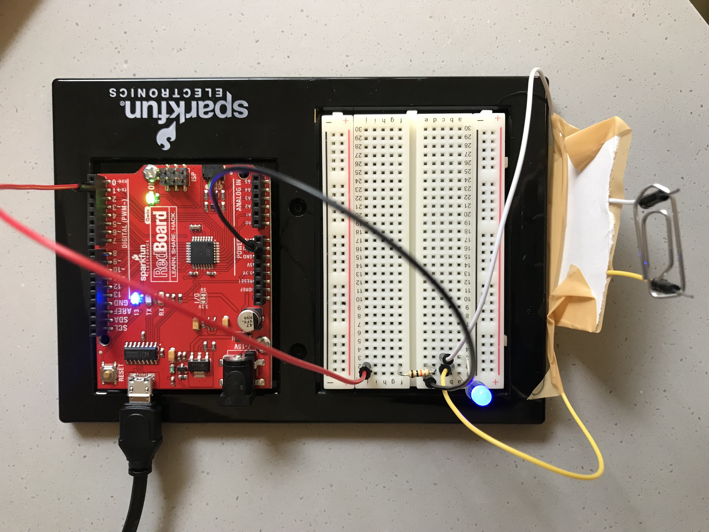

**Here is the description of my hands free switch**

*Switch Name: Look Ma, No Hands!*

This switch is inspired by the fact that one of the things I associated most with currents as a child was to be careful of electricity around water. So I decided to use my own tongue to turn on this LED light. Of course, I made sure that the power source is low - since it is connected via USB from my laptop, the voltage should be set at around 5 volts. I know the common gag of licking a 9V battery for a minor electric shock, so this seemed safe as well. (I was also well-assured by the person helping me make this switch that I would survive.)

I connected my ground (black wire) to the 1st row, and my red wire to the 2nd row. I left a gap using the LED itself, placing the negative end in the 1st row and the positive end in the 3rd row. A 330 resistor connects the power to the 2nd row, where I put in a new wire (yellow) to use for the switch. A white wire is in the 3rd row and operates as the other part of the switch.

These yellow and white wires are taped to a piece of cardboard on the side of the baseboard, so they are standing vertically, with about an inch between them that my tongue can fit between. By placing my tongue (making sure it touches both wires) I can turn on the light, hands-free.

**Here are my images**

