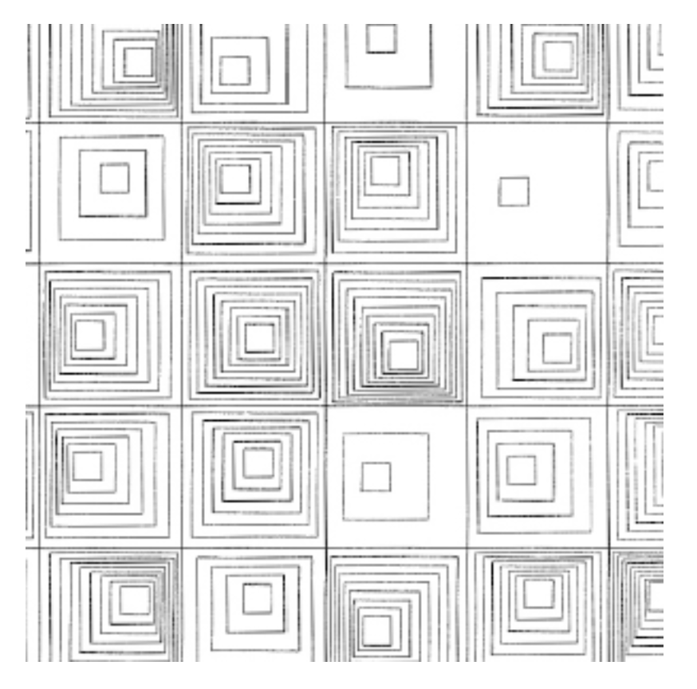
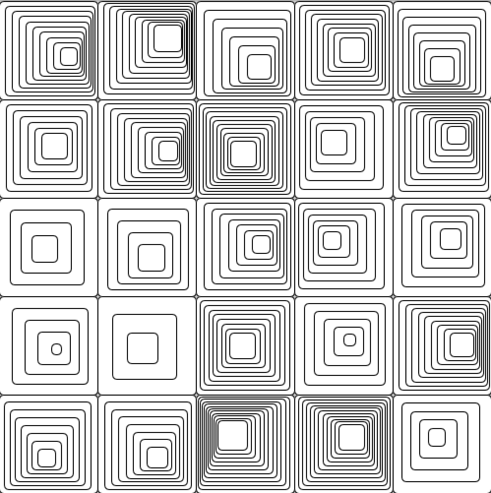
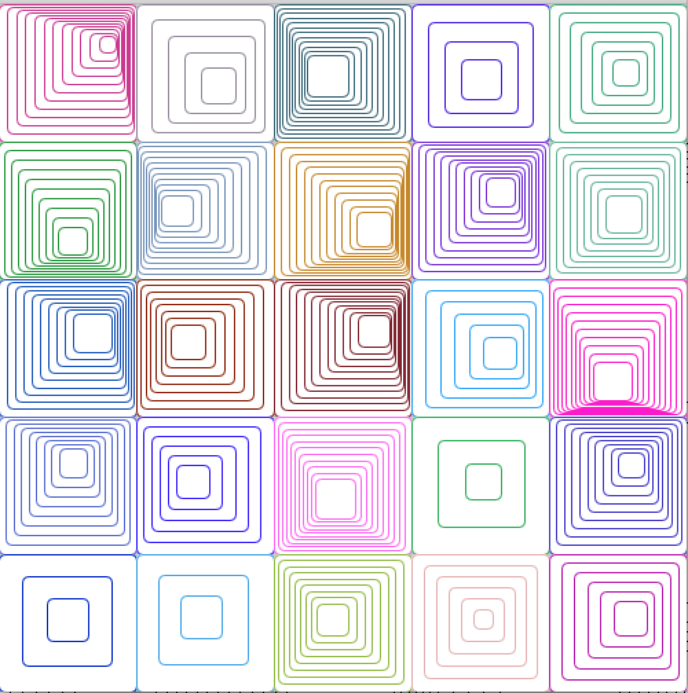
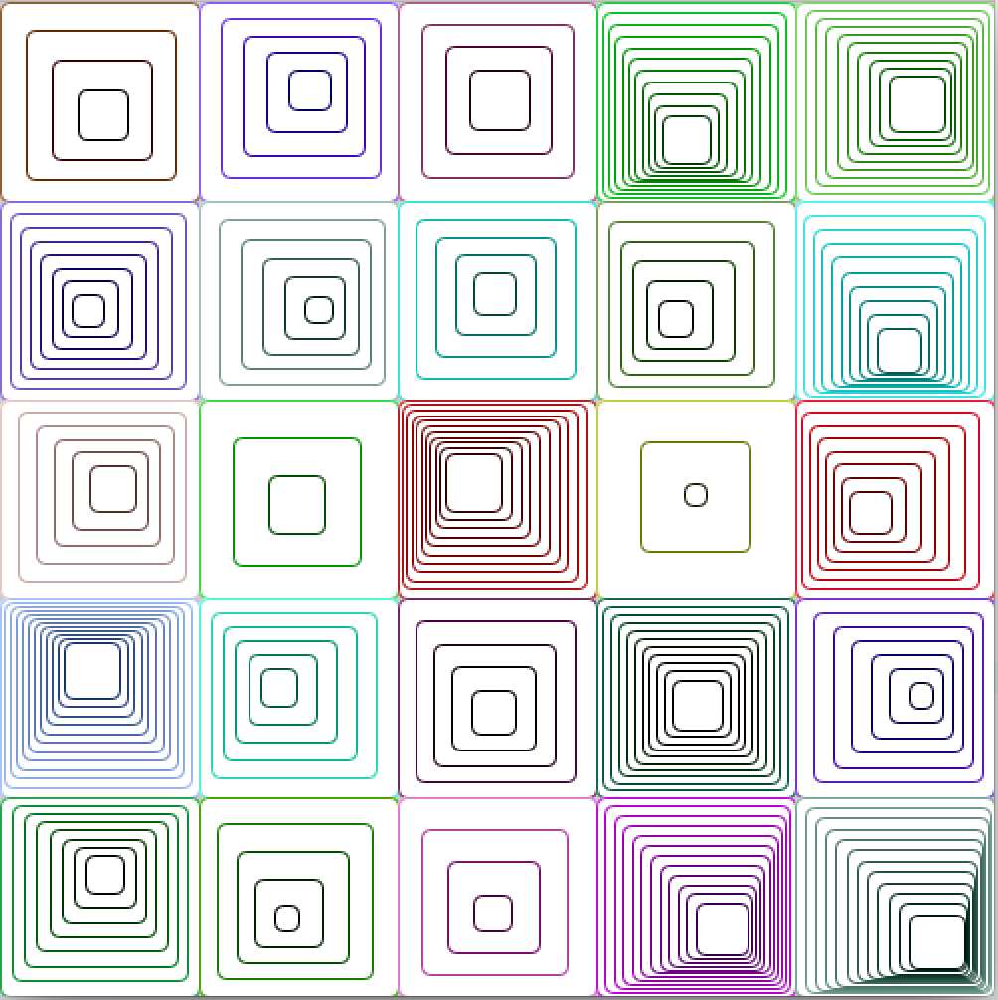

# Computer Art: Nested Squares

*Inspiration drawn from [Random Squares by William Kolomyjec](http://recodeproject.com/artwork/v2n3random-squares), in Computer Graphics and Art (1977)*

## End Result

The dynamic final piece included color:

## Coding Process

Using nested for loops greatly simplified the code because it allowed for a loop which created the nested squares, repeated it across a row, and repeated the row four more times to fill up the screen. Certain elements of creating the boxes were random, as in the original piece, such as the number (iterations) of nested squares, the offset between them, and the color.

For the final piece I added some pizzazz by having it in color (randomly generated RBG values for each squares), with the option of adding a gradient within the nested box if desired. Each time the mouse is clicked, the drawing resets with new colors and new boxes - [here is a video](https://youtu.be/5EXfRUWTA1s) of what that looks like.

