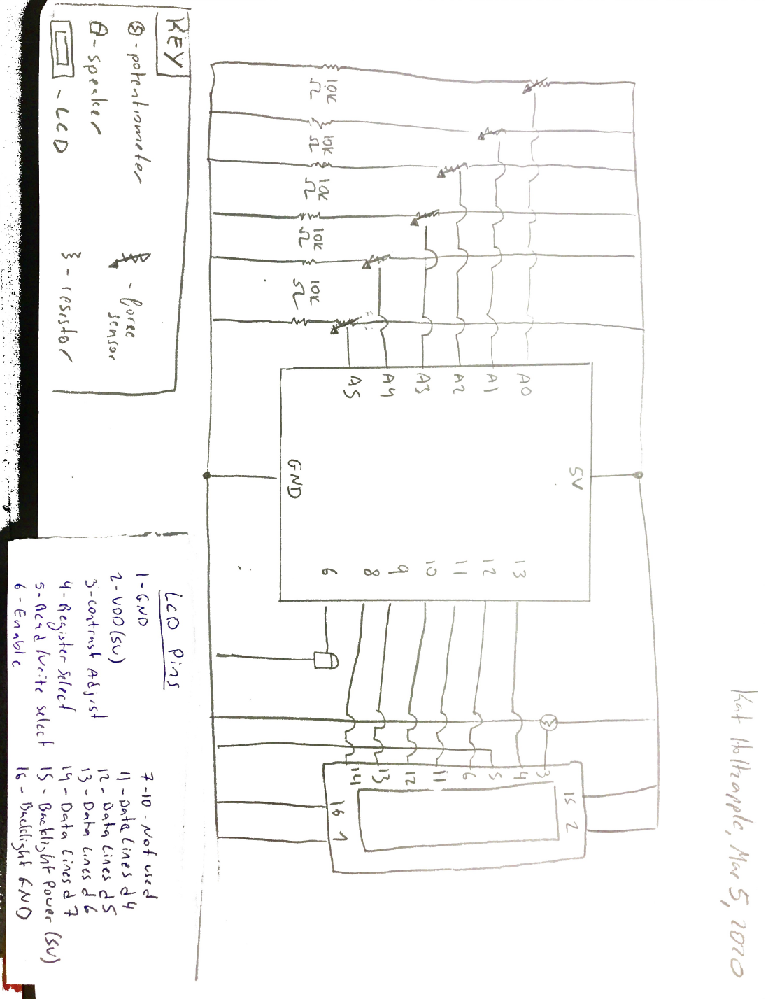
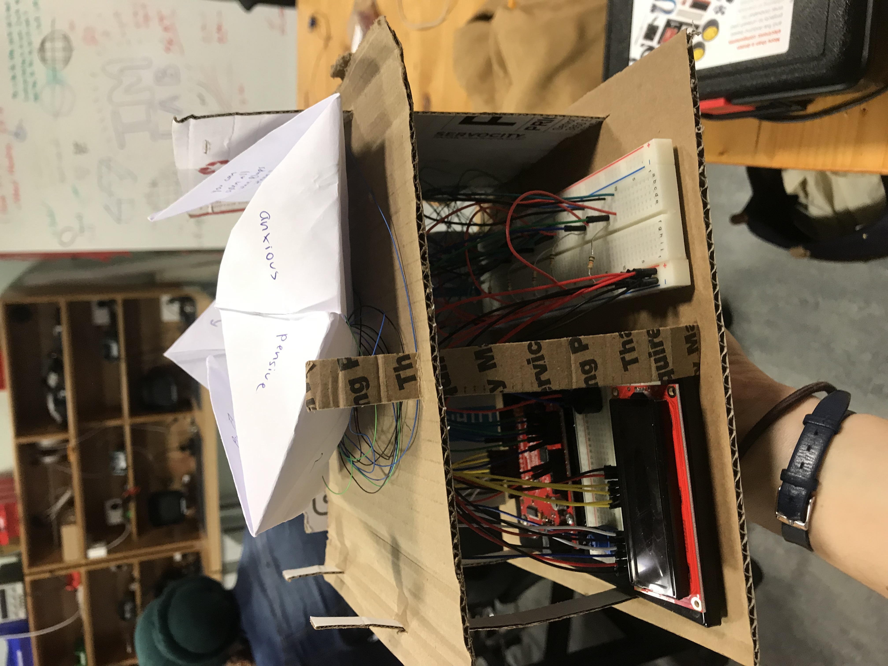
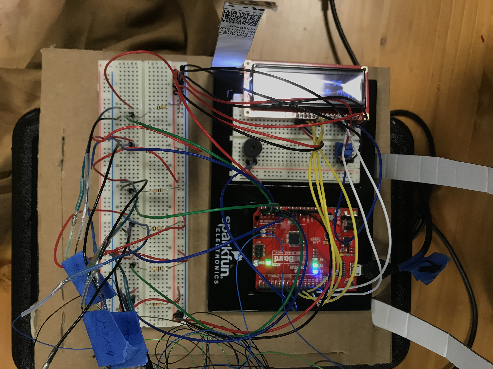
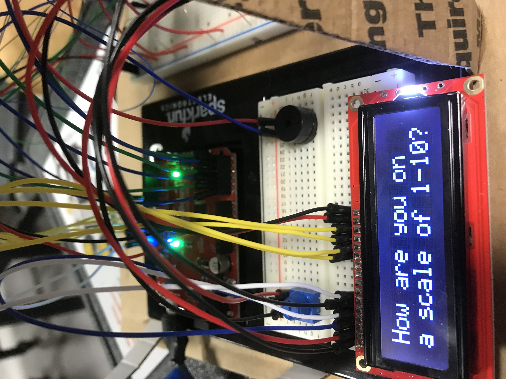
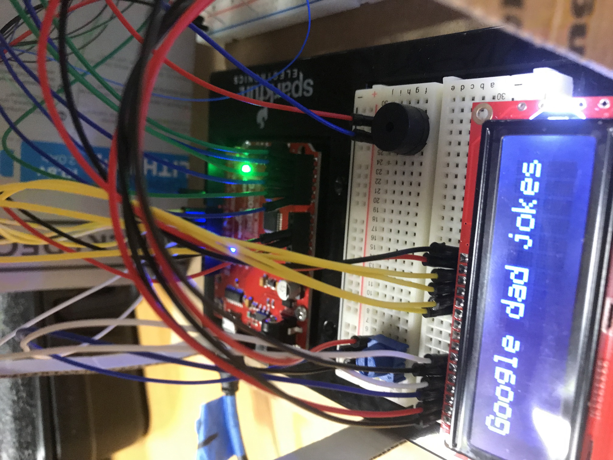
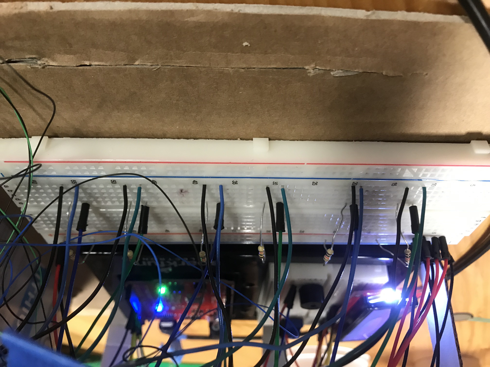

**REASSURING MESSAGE CHATTER BOX**

March is Mental Health Awareness Month!

Life can get tough sometimes and we could use a reassuring message or good thought to keep us going. 

The *Reassuring Message Chatter Box* is a spin on the traditional fortune teller chatter box of our elementary school years. This one interacts with an LCD screen that prompts users to start by rating their day on a scale of 1-8, and then choosing a mood. When the user flips open the paper flap, instead of a fortune, there will be a prompt to 'press here' and then a reassuring message appears on the screen, along with a little jingle.

**Circuit schematic and code**

**Photos of the project**

**[Here](https://youtu.be/LRDFwVQERRk) is a video that shows my project while it was in progress**

*The circuit was broken with the force sensors not getting power from 5V, only connected to GND and the Arduino pin, so it was not working.*

**[Here] (https://youtu.be/UsHE58BzGGM) is a video that shows my project at the end, almost fully working!**

*The 'bored' sensor is broken, so that one doesn't work..*

**Problems and possible solutions**
The 'bored' sensor seems to not be working - I think its just the sensor itself that needs to be switched out, because it used to work and then stopped registering raw values beyond about 3. I think it may have broken or snapped, but I did not have enough time to move it. 
