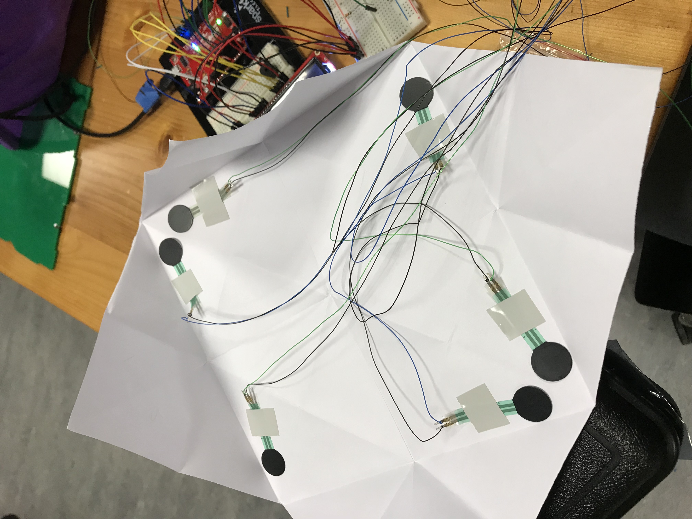

# REASSURING MESSAGE CHATTER BOX

March is Mental Health Awareness Month!

Life can get tough sometimes and we could use a reassuring message or good thought to keep us going. 

The *Reassuring Message Chatter Box* is a spin on the traditional fortune teller chatter box of our elementary school years. This one interacts with an LCD screen that prompts users to start by rating their day on a scale of 1-8, and then choosing a mood. When the user flips open the paper flap, instead of a fortune, there will be a prompt to 'press here' and then a reassuring message appears on the screen, along with a little jingle.

## Description and build:

Though the code itself is a fairly simple mix of the if, for, and mapping statements I've been learning so far, a lot of the work came in the construction of the project. I learned how to properly solder the force sensors (using the wire and spinning tool), then had to adapt the design because there are only 6 analog inputs on the Arduino, but 8 possible moods on the chatterbox. I also was very confused at why certain force sensors were not working, until I realized I had incorrectly built the circuit for all of them (lesson: *not everything that works actually works!*)

I also changed the chatterbox paper from A4 to A3 paper in order to make it large enough to fit the force sensors without bending them. I also realized asking people to rank their mood on a scale of 1-10 was dumb, because there were only 8 numbers on the chatterbox itself. Would not have realized this without user testing. 

**Using the spinning tool to wrap wire around the force sensor to then solder**

**Placing the force sensors under each flap**

Once the project was done, it worked well and I'm so glad! I had mapped the values so that any force reading under a mapped value of 2 would lead to the message, which means having to press fairly hard but also prevents the messages from appearing while the chatterbox is being used.

**Photos of the project**

**[Here](https://youtu.be/LRDFwVQERRk) is a video that shows my project while it was in progress**

*The circuit was broken with the force sensors not getting power from 5V, only connected to GND and the Arduino pin, so it was not working, hence the music and message appearing beforehand.*

**[Here](https://youtu.be/UsHE58BzGGM) is a video that shows my project at the end, fully working!**

*Yay!*

## Problems I ran into and possible further developments

Other than simple design issues like changing the ranking of mood from 1-10 to 1-8, or changing the paper size, here are some of the issues I ran into and how I fixed them:

1) The largest problem I ran into, I now realize, was a problem of circuit building. I figured it out by looking up videos of people using force sensors online, then recreating them exactly, which is how I realized I had incorrectly attached the 5V to the force sensors. A quick fix later and all my sensors finally worked!

2) The tone/melody playing after the message appears. I originally wanted just one tone, which I got Michael to show me how to do, but then it was too much like an alarm, so I changed it to a tone. I'm still not fully happy with it and would like to find a more relaxing melody, maybe tailoring a melody to each mood by setting different melody variables, and having it play once. I know I could do it with more time, but I was afraid of messing up a project that was finally working!

3) Properly mapping. When I had fixed the circuit issue, I then had to go through a re-map everything. Because I had associated lower raw values with touching the sensor, I kept incorrectly mapping it (for the sensors, the low raw values often meant no touch!) so properly commenting which should go first, (touch, no touch) rather thann remembering, helped a lot.

4) At one point, one of the sensors was only reading at a raw value of 3, regardless of what was pressed. I thought the sensor may have just been broken, because it was one of the ones I had been playing with the most while testing and it very likely could have snapped or broken somewhere. But after resetting the code it worked properly! One of life's mysteries, maybe there was an error in the code?

5) Finally, I would love to create a better build or set-up for the project. Though the cardboard made it easy for me to keep playing with my circuit, I would love to build something a little more durable and pretty.
